# Apache Nifi On-Premise AI Image Catalogue Workflow

Do you have thousands of images on your hard disk and want to find them using a simple text query? This step-by-step guide will help you feed your local image library to a local AI, which will generate meaningful descriptions and keywords for them. The results are then stored in a structured format in a document-oriented database — all completely under your control on your own machine!

This setup demonstrates the use of Apache NiFi to integrate freely available LLMs (large language models) without relying on external AI services like ChatGPT. Once set up, it runs entirely offline.

# Setup and Walk-Through

After checking out this GitHub project, start the Docker containers that are configured in ```docker-compose.yml``` on your command line:

```Bash
docker compose up -d
```

## Download LLMs with Open WebUI

After docker downloaded the image files and started up the containers, open Open WebUI in your browser at http://localhost:3333 . Except for the model administration using WebUI is purely optional for our showcase, but it’s a useful (and fun!) way to experiment and track your models.

On your first access, you’ll need to create an account. Don’t worry—everything is stored locally on your machine.

First, we need to download a language model. Since the model is about 4.4 GB, the download may take some time.

Open up the admin panel:

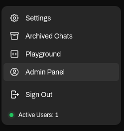

Go to the model settings:

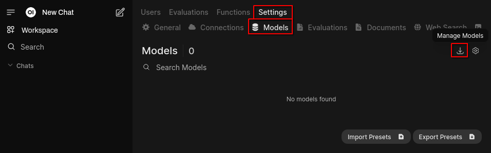

Download the "llava:7b" model to our local Ollama instance:

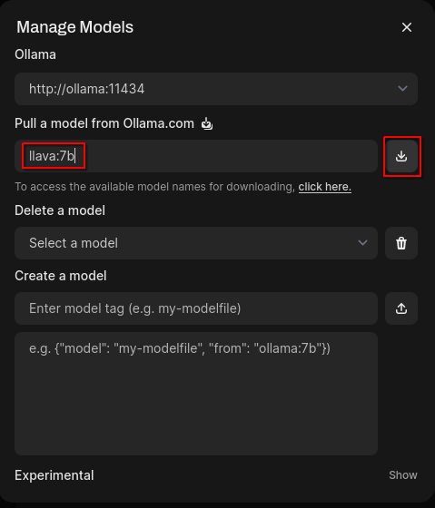

Llava is a multimodal model, meaning it can process images as well. The "7b" version is the smallest available and sufficient for now. When the download is finished, close the dialog. Now, let’s start a chat (click "New Chat"):

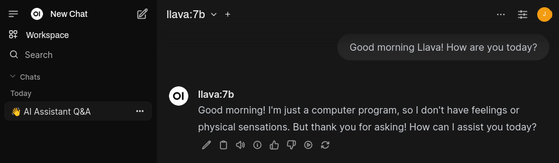

You can also upload pictures and as questions about them:

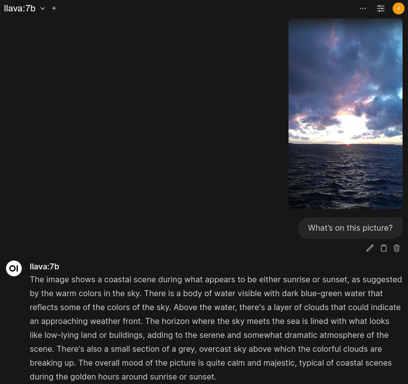

## Set Up the BaseX Database

To store all image file information in a centralized location, we use a database. Here, we use the XML document database BaseX. All we need for now is to create a named database instance.
1. Open up the BaseX database administration in your web browser at http://localhost:8884/dba
1. Log in using the credentials "**admin**" and "**password**"
1. Create a new database called "**imagedb**" and select "**Fulltext Indexing**" and "**Stemming**" and click "Create":

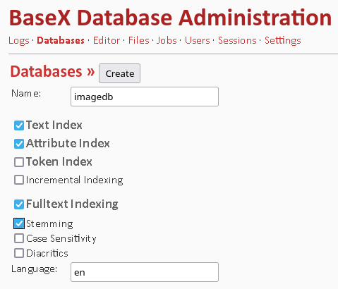

That's it for now.

## Automate Data Input with Apache NiFi

While you can use WebUI to analyze images and manually copy-paste results into a spreadsheet or database, automating the process makes more sense for thousands of images. Apache NiFi to the rescue!

1. Open NiFi in your web browser at https://localhost:8443/nifi (you'll need to accept the SSL certificate exception).

1. Log in with "**admin**" and "**adminpassword**". (See ```docker-compose.yml``` to change the credentials if needed.)

1. You'll see an empty NiFi flow canvas. Create a new process group by pulling the "process group" icon onto the canvas:
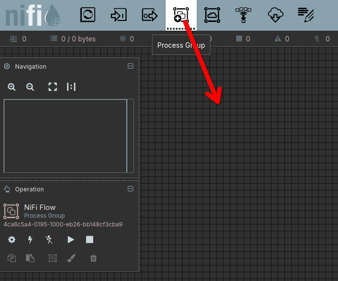

1. Upload the prepared process group file ```AI_Catalogue_Image_Files.json``` and click "Add":

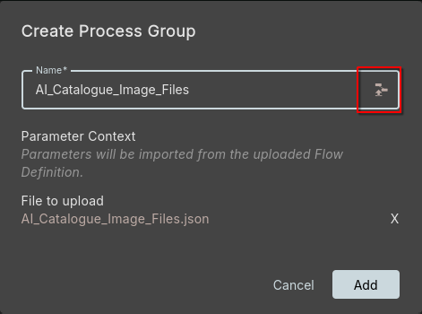

1. Since the imported file does not contain sensitive parameters, set the database password in a "Parameter Context" as follows:
1. Right-click the new process group "**AI_Catalogue_Image_Files**", select "**Parameters**" and edit the "**basex_password**" parameter:
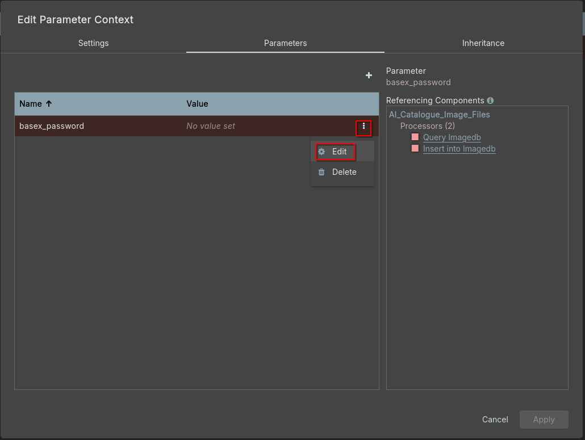
1. Set the value to "**password**"

### Start the Process Group

1. Double-click the process group "**AI_Catalogue_Image_Files**" to enter it.
1. Right-click on an empty spot of the canvas and select "**Enable All Controller Services**":
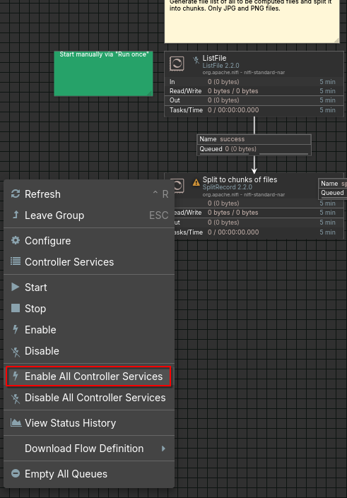

1. Right-click again and select "**Start**":
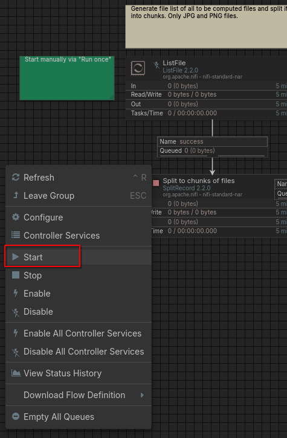

All process boxes should now show a green "play" icon, except the first "ListFile" which should still be disabled.

### Analyze your Images

1. Copy a few image files (JPEG or PNGs) into the ```work/``` folder.
1. Right-click "**ListFile**" process, select "**Enable**", but do not start it yet (it should show a red square icon). The process is configured to list and process all files in the ```work/``` folder, so we only want to run it once. 
1. Right-click "**ListFile**" and select "**Run Once**":

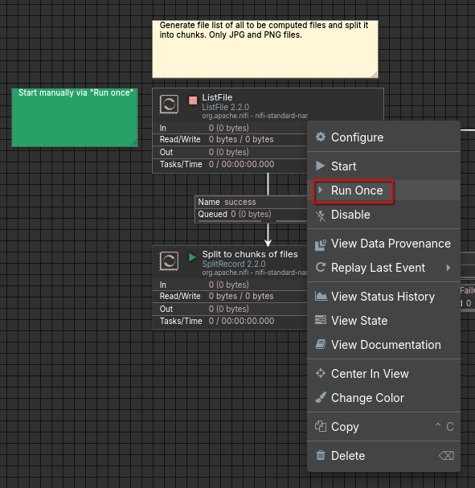

After a while, the process group should have processed all your images and written a document for each of them to the database. The number of in the last queue should equal the number of files you put in the work folder. In this case there were only three:

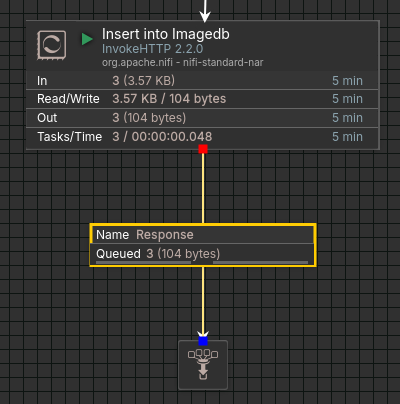

Exploring the details of the NiFi process group configuration is beyond this guide, but you’re encouraged to check the comments, process configurations and the extensive [NiFi documentation](https://nifi.apache.org/components). 

## View Results in the Database

In BaseX DBA, you can now view the generated XML documents:

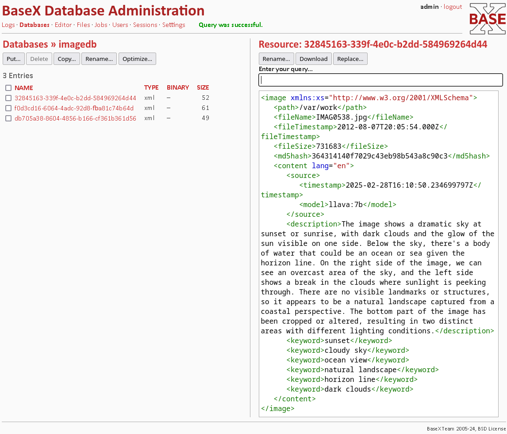

Our process didn’t just copy the description from LlavA — it also extracted structured keywords and technical file metadata such as timestamps, file sizes, and MD5 hashes. These attributes help track file changes or detect duplicates. We also store details about the language model used, allowing us to add data from additional LLMs in the future.

One of the first process steps in our NiFi process group is to filter the file names against the already known files in the database, so they will not be processed twice. You can select and delete documents here in BaseX, so they will be generated again.

### Querying the Data

To query your new dataset, use XPath or XQuery in the "**Editor**" tab:

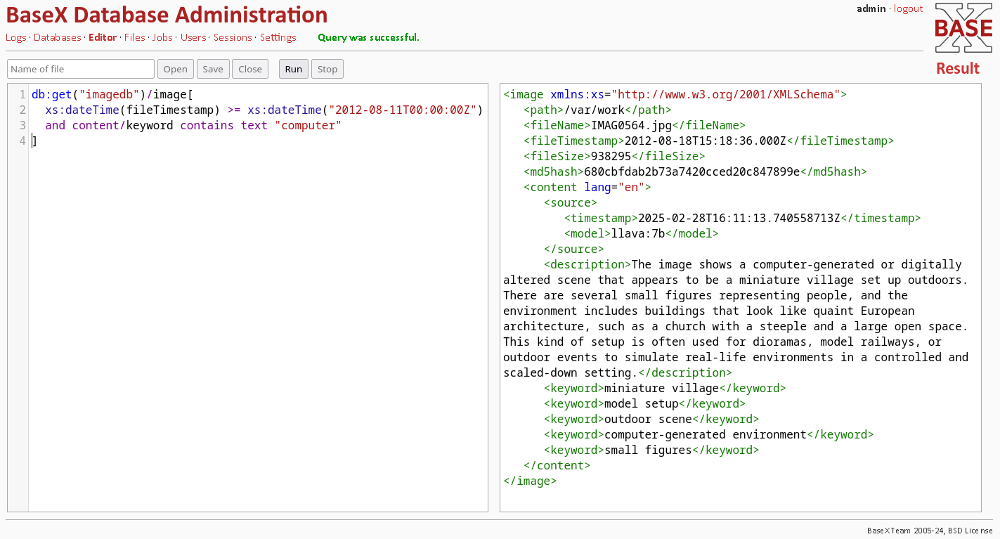

### Example Queries

**XPath to find images newer than August 11, 2012, that contain "computer" in their keywords:**
```XQuery
db:get("imagedb")/image[
  xs:dateTime(fileTimestamp) >= xs:dateTime("2012-08-11T00:00:00Z")
  and content/keyword contains text "computer"
]
```

**XQuery to return only the file names of some old files:**
```XQuery
<oldImages> {
  for $i in db:get("imagedb")/image[
    xs:dateTime(fileTimestamp) lt xs:dateTime("2012-08-20T00:00:00Z")
  ]
  return
    <file name="{concat($i/path, '/', $i/fileName)}" />
}
</oldImages>
```

**Example output:**
```XML
<oldImages>
  <file name="/var/work/IMAG0538.jpg"/>
  <file name="/var/work/IMAG0560.jpg"/>
  <file name="/var/work/IMAG0564.jpg"/>
</oldImages>
```

**Perform fuzzy full-text search:**
```XQuery
db:get("imagedb")/image[
  content/description contains text "compooter" using fuzzy
]
```

# What's next?

Apache NiFi, Ollama and BaseX form a powerful combination for process automation and data integration. These tools can be used not only for [ETL](https://en.wikipedia.org/wiki/Extract,_transform,_load) but also for automating and enhancing communication between systems. More examples will be added in the future.

---
---

# Components

## Docker
All components are assembled and configured in a single docker-compose.yml file. See the [Docker Compose manual](https://docs.docker.com/compose/) if this is new to you.

## Apache NiFi
[Apache NiFi](https://nifi.apache.org) is a free and open source workflow engine with a nice web-based workflow modeller. It is well suited to aggregate and integrate different data sources and sinks and has been developed to work excellently with large sets of data. A big bonus is that you can stop parts or complete processes and make ad-hoc changes anytime, even while data processing is still going on.
Also it is very transparent, which set of data is currently in which processing step and which way it took.
NiFi will be running here: https://localhost:8443/nifi

## Ollama
[Ollama](https://github.com/ollama/ollama) allows to easily manage large language models and provides a unified API to interact with them.
There are different Docker images for Ollama available. See the comments in docker-compose.yml to choose one that might be optimal for your available hardware. The default uses only your local CPU, which performs okayish for this show case, but you might want to try out the accelerated Ollama images for current Nvidia or AMD GPUs or th e Intel IPEX image if you own an Intel ARC GPU or iGPU.

## Open WebUI
[Open WebUI](https://github.com/open-webui/open-webui) provides a sophisticated web frontend to Ollama and (if needed) other chat services. In addition to features you might know from [ChatGPT](https://chatgpt.com), it allows to administrate the Ollama backend, like installing or removing new LLMs from the internet.
The UI web frontend will be available here: http://localhost:3333

## BaseX
[BaseX](https://basex.org/) is my document oriented XML database of choice. It's free, open source, well-maintained and powerful. In this scenario we use it to store and retrieve the collected data as small XML documents. It also offers a web frontend, you can use to have a look at the data and make XQuery requests.
The BaseX web frontend will be available here: http://localhost:8884/dba

# Files

* ```docker-compose.yml```
The main setup definition for all the components above.

* ```AI_Catalogue_Image_Files.json```
This is our Apache Nifi process group you can import manually via NiFi's web frontend. It contains the whole logic of this project.

* ```data/```
This is an (initially) empty directory. It's the designated mount point for Ollama's model data. Since the downloaded model files may have many GB you might want to treat this data special. E.g. link this folder to an external storage, or just keep it away from your backup routine.

* ```work/```
Another initially empty directory. It will be mounted by the NiFi container. Copy your image files here to let them get analyzed by our workflow.

* ```users.xml```
This is mounted into the BaseX container and contains the dummy credentials for the BaseX admin user. The hashed password is "password" until you change it via the BaseX web frontend.
